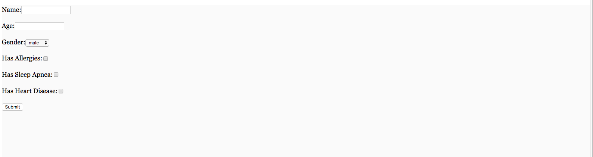

### PG Coding Challenge Module Example

This repository provides a running example of the usage of the [PG Coding Challenge Module](https://github.com/JamesAnthonyLow/pg_coding_challenge_module/blob/master/README.md) built as a solution to the problem stated in the interview [spec](https://docs.google.com/document/d/15f4hiBdM26FcEdJDLWt7tacP5Jic5StUlwv4JLxT9BU/edit).

The PG Coding Challenge Module Example utilizes [Docker](https://www.docker.com/) to satisfy the necessary dependencies for this project.  All of which are specified in the ```package.json``` file in the root directory and can be installed locally by running `npm install` **after running ```git submodule init && git submodule update``` in order to pull the PG Coding Challenge Module local repository**.  If you use docker all you need to do is make sure the Docker daemon is running and then you can use the following bash scripts to run the project:

```bash
$ ./build_docker.sh ## to build the Docker image
$ ./run_docker.sh ## to run the server on http://localhost:3000
$ ./kill_docker.sh ## to terminate the server and the Docker container
```

The server is run on [http://localhost:3000](http://localhost:3000). Tuning to that page in a browser will provide the following interface:



From here you can enter the following test cases:

```
Name | Age | Gender | Conditions
Kelly | 50 | female | Allergies
Josh | 40  | male  | Sleep Apnea
Brad | 20 | male | Heart Disease
```

and expect the following output in the form of a javascript alert:

```
Kelly $210.20
Josh $190.80
Brad $117.00
```

This repository was forked from [policygenius/react-skeleton](https://github.com/policygenius/react-skeleton).  However it is not meant to represent a good example of a scalable React app but rather to provide a proof-of-concept regarding the PG Coding Challenge Module.

Relevant code for this example is located in the ```app/containers/App``` folder:

- ```index.js```: contains the react code for the form and an example of an instantation of a Subscriber object.
- ```pricingSchema.js```: contains an example of a pricing schema.
- ```subscriberSchema.js```: contains an example of a subscriber schema.

These concepts are elaborated in greater detail in the [PG Coding Challenge Module README](https://github.com/JamesAnthonyLow/pg_coding_challenge_module/blob/master/README.md).
